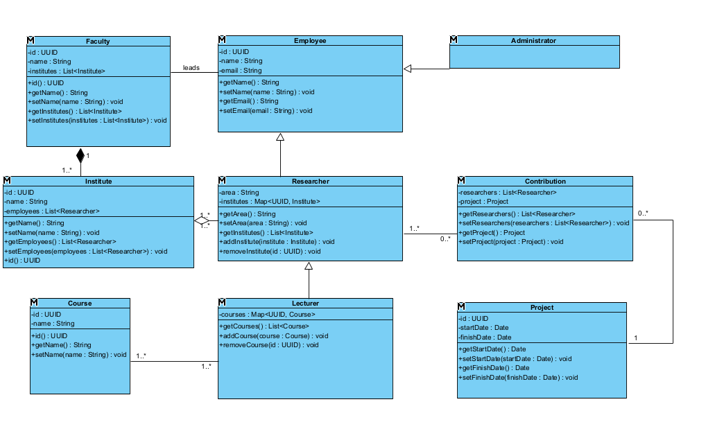
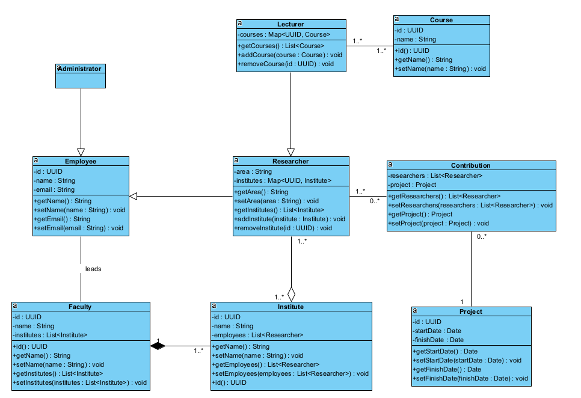
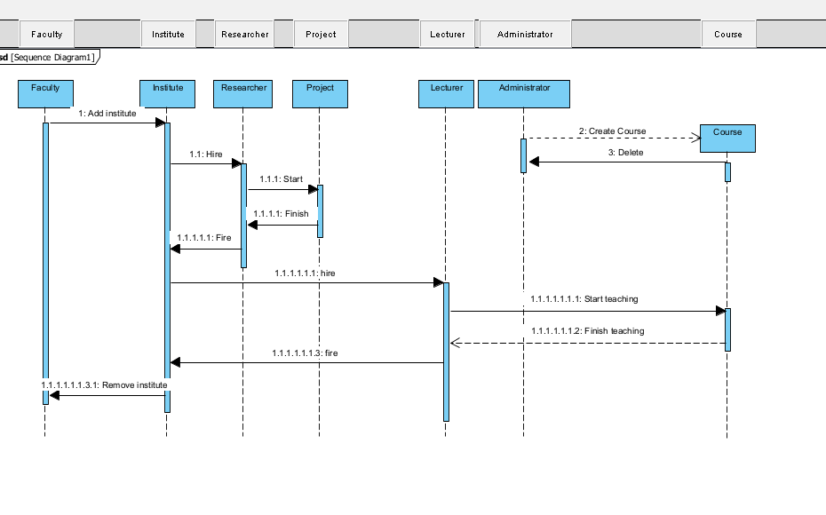
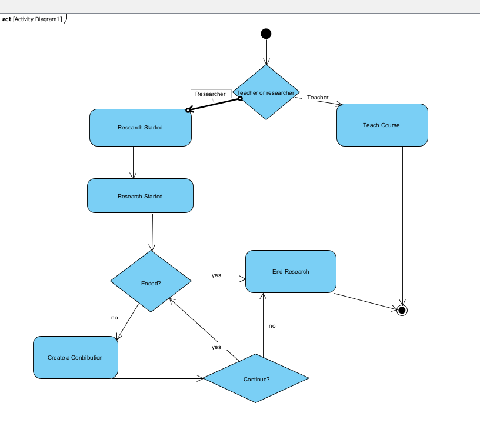
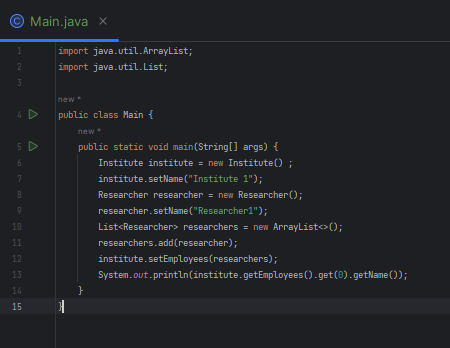
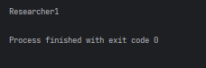

# PIAPS lab 10 (university system)
---
## Use Case Diagram
---

## Class Diagram
---

## Class Diagram (reversed from Java)
---

## Sequence Diagram
---

## Activity Diagram
---

## Test run
---

